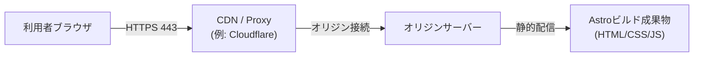
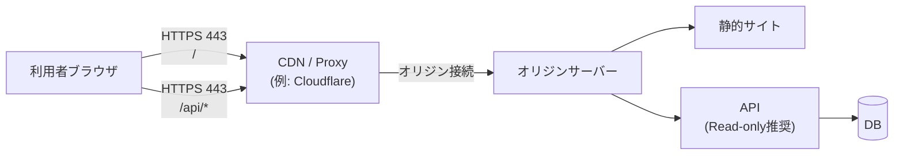
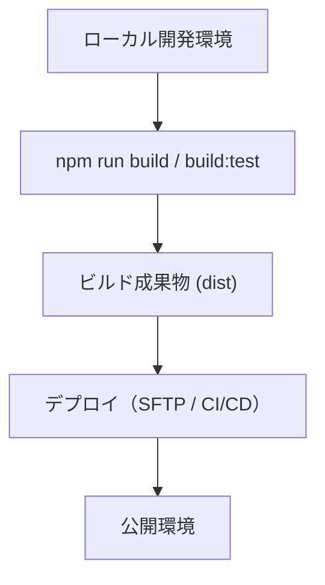

# Webアーキテクチャ（ベーステンプレート）

この文書は、Astroベースの案件で再利用するための「構成ベース」です。  
案件ごとに、ドメイン名・ページ構成・外部連携・運用手順を差し替えて使用してください。

---

## 1. 目的

- 公開サイトの構成と責務分離を明確化する
- 配信経路・データフロー・運用フローを可視化する
- 開発者/運用者/関係者の共通認識を作る

---

## 2. サイト構成（例）

公開サイト（静的配信）

`https://example.jp`

- `/` トップページ
- `/about/` 事業・会社情報
- `/news/` お知らせ一覧
- `/contact/` 問い合わせ

必要に応じて追加:

- `/consumer/` 利用者向け
- `/merchant/` 事業者向け
- `/stores/` 検索ページ

---

## 3. 環境・ビルドモード

このテンプレートは mode 分離を前提にします。

- production: `npm run build` / `npm run build:prod`
- test: `npm run build:test`

判定は `src/utils/runtimeMode.ts` を利用します。

- `isDevMode`
- `isTestMode`
- `isProdNonTestMode`

想定用途:

- 計測タグの出し分け
- テスト向けエンドポイントの切り替え
- デバッグログ制御

---

## 4. 全体アーキテクチャ（静的配信のみ）

---

## 5. 全体アーキテクチャ（API併用時）

検索機能やデータ参照が必要な案件では、以下の構成を採用します。

補足:

- APIは原則 Read-only（更新系は管理系に分離）
- 公開サイト側は UI と表示責務に集中

---

## 6. デプロイ運用フロー（ベース）

API/DBがある場合は追加:

- データ更新は別フローで管理
- 本番DBの直接編集は避ける

---

## 7. フロントエンド実装方針（現行テンプレート準拠）

- Astro v6 を中心に静的配信
- Tailwind CSS v4 + daisyUI を主軸にUI構築
- CSS変換は `lightningcss`（PostCSSパイプラインは非採用）
- StylelintでSMACSS順を自動補正（`npm run fix:css`）

補足:

- コンポーネントはコンテナクエリ優先
- 難しい場合のみメディアクエリを許容

---

## 8. Material Icons 最適化

本テンプレートでは、Material Icons/Symbols を固定で丸読みせず、使用アイコンのみ読み込みます。

- `src/utils/materialIconStylesheets.ts`
  - ソース走査で使用アイコン名を抽出
  - `icon_names=`付きGoogle Fonts URLを生成
- `src/layouts/Layout.astro`
  - 必要時のみ `<link rel="stylesheet">` を出力

効果:

- 不要なフォントCSS読み込みの削減
- 初期表示コストの抑制

---

## 9. セキュリティ設計方針（ベース）

- HTTPS を前提とする
- 公開側に秘匿情報を置かない
- API併用時は CORS を最小化
- 可能なら WAF / CDN / レート制限を利用
- 更新系APIは公開サイトから切り離す

---

## 10. 運用設計方針（ベース）

- 本番サーバー上で直接編集しない
- 変更はGit管理し、ビルド成果物をデプロイ
- mode別ビルドを使い分ける
- 依存更新時は `build` と `build:test` の両方で検証

---

## 11. 責務分離

- 静的サイト: UI表示
- API: 検索・参照ロジック（必要時）
- DB: データ保管（必要時）
- ローカル/CI: ビルド・検証・デプロイ
- CDN/Proxy: 配信最適化・防御

---

## 12. 案件着手時の差し替えチェックリスト

- ドメイン/サイト名/OGP情報
- ページ構成（ルート設計）
- mode別の外部タグ出し分け
- API有無と責務境界
- データ更新フロー（誰が・どこで・どう反映するか）
- デプロイ手順（SFTP/CI/CD）
- 監視・障害対応連絡先
